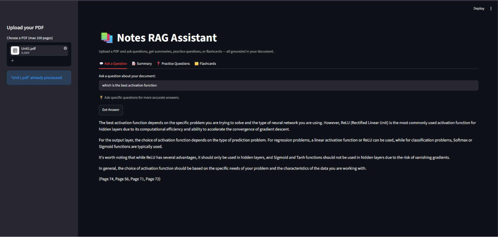
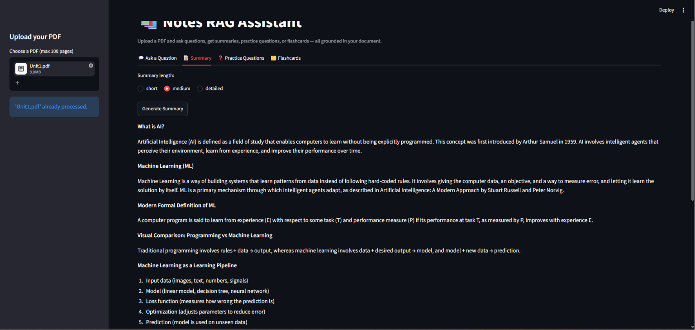
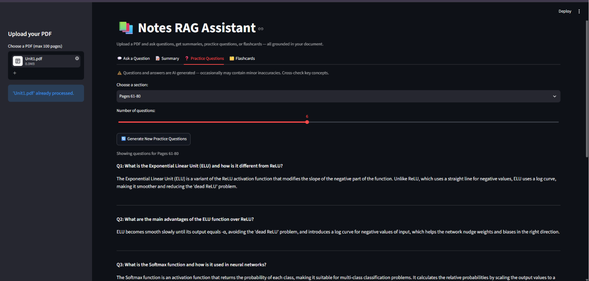
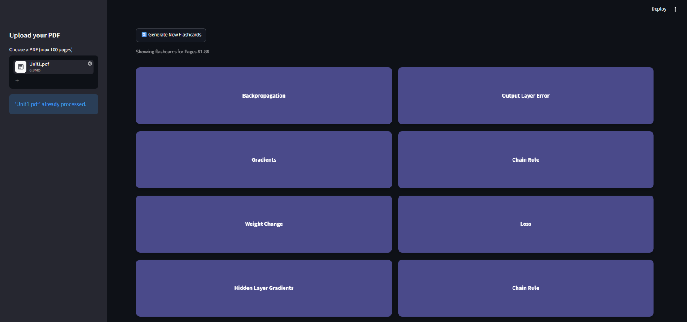

# Notes RAG Assistant

A Retrieval-Augmented Generation (RAG) app that turns a PDF into an interactive study tool — ask questions with page citations, get summaries, generate practice questions, and create flashcards, grounded in the document content.

## Features

- **Q&A with page citations** — ask questions about the document, get answers with the source page number(s), grounded only in the retrieved content.
- **Summarization** — short, medium, or detailed summaries. Avoids repeating points across sections, preserves mathematical formulas as extracted from the text.
- **Practice question generation** — section-wise (grouped by page ranges), mix of conceptual and factual questions with detailed answers, duplicate filtering.
- **Flashcards** — section-wise, flip-to-reveal UI, definitions grounded in the document rather than generic textbook definitions.

## Tech Stack

| Component | Technology |
|---|---|
| UI | Streamlit |
| LLM | Groq API (`llama-3.1-8b-instant`) |
| Embeddings | `BAAI/bge-small-en-v1.5` (sentence-transformers) |
| Vector search | FAISS (`IndexFlatIP`, cosine similarity) |
| PDF parsing | PyMuPDF |
| Chunking | LangChain `RecursiveCharacterTextSplitter` |

## Architecture

```
                PDF
                 │
                 ▼
        Page-wise Extraction
                 │
                 ▼
    Recursive Character Chunking
                 │
                 ▼
     Sentence Embeddings (BGE)
                 │
                 ▼
            FAISS Index
                 │
        User Question / Request
                 │
                 ▼
     Semantic Similarity Search
                 │
                 ▼
      Retrieved Relevant Chunks
                 │
                 ▼
        Groq Llama 3.1 8B
                 │
                 ▼
         Grounded Output
```

## How It Works

1. **Ingestion** — PDF is parsed page-by-page (PyMuPDF), then each page is chunked separately (chunk size 600, overlap 75) so every chunk retains its page number as metadata.
2. **Embedding & Indexing** — chunks are embedded with BGE and indexed in FAISS using inner-product search over normalized vectors (cosine similarity).
3. **Retrieval** — the user query is embedded and matched against the index to get the top-k relevant chunks.
4. **Generation** — retrieved chunks are passed to the LLM with task-specific prompts (Q&A, summary, questions, flashcards) to produce grounded, cited output.

## Known Limitations

- Groq's free tier has a 6000 tokens/minute limit. Context size and retry logic are tuned to stay within it.
- Practice questions/flashcards use a word-overlap check to filter duplicate items. It catches reworded duplicates but can occasionally miss two items that ask about the same concept in very different words.
- Formulas rendered as images or vector graphics in the PDF (not selectable text) are not extracted.
- LLM-generated answers/definitions may occasionally contain inaccuracies — flagged with an in-app caution notice.

## Screenshots

### Question Answering


### Summary


### Practice Questions


### Flashcards


## Setup

1. Install dependencies:
   ```bash
   pip install -r requirements.txt
   ```

2. Get a Groq API key from [console.groq.com](https://console.groq.com).

3. Create a `.env` file in the project root:
   ```
   GROQ_API_KEY=your-key-here
   ```

4. Run:
   ```bash
   streamlit run app.py
   ```

## Project Structure

```
notes_bot/
├── app.py
├── requirements.txt
├── README.md
└── src/
    ├── config.py
    ├── ingest.py
    ├── embed.py
    ├── retrieve.py
    └── generate.py
```

## Author

Gauri Dhingra — B.Tech CSE (AI & ML)
